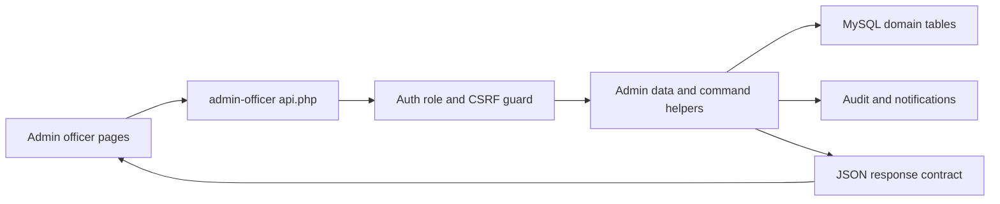

# Admin Officer Backend Integration Plan

## 1. Phase 1 Scope

Phase 1 includes full backend integration for all admin officer pages:

- `dashboard`
- `profile`
- `providermanagement`
- `learnermanagement`
- `analytic-reports`
- `settings`
- `courses`
- `reports`
- `users`

This phase also includes routing activation for currently orphaned pages and end-to-end data flow from UI to database.

---

## 2. Current State Assessment

### What already works

1. Authentication and role guard for admin officer page entry.
2. Provider approval workflow already persists decisions and updates provider status.
3. CSRF helpers and session helpers already exist and are reusable.
4. Existing API patterns are present in other modules and can be mirrored.

### What is missing or inconsistent

1. Admin routing does not include `courses`, `reports`, and `users`, even though files exist.
2. Most admin pages are static markup with placeholder values and no backend bindings.
3. Admin-specific data logic is currently coupled inside provider data helpers.
4. Profile page behavior is frontend-only local state and not persisted to database.
5. No dedicated admin API layer for asynchronous filtering, table refresh, and settings updates.
6. No centralized admin audit trail for critical moderation actions.

---

## 3. Target Architecture

### 3.1 Routing and page composition

1. Expand admin route whitelist to include `courses`, `reports`, and `users`.
2. Keep page composition in `admin-officer/index.php` as the router entry point.
3. Keep shared layout structure intact and integrate data in page fragments.

### 3.2 Domain boundaries

Move admin domain logic out of provider helper space.

Create admin-specific helper modules:

- `admin-officer/includes/admin_data.php`
  - read-only queries for dashboard, users, learners, providers, courses, reports
- `admin-officer/includes/admin_commands.php`
  - write actions like approve or reject provider, approve or reject course, settings save
- `admin-officer/includes/admin_audit.php`
  - audit logging and activity feed writes

Reuse:

- auth and CSRF helpers from shared includes
- DB connection from config

### 3.3 High-level data flow



---

## 4. Admin API Contract

Create `admin-officer/api.php` with action-based dispatch and strict response envelope.

### 4.1 Request standards

1. Read actions allow GET.
2. Write actions require POST plus CSRF token.
3. Every action validates role as `officer`.
4. Input validation errors return 422 with field-level map.

### 4.2 Response standards

Success payload:

```json
{
  "ok": true,
  "data": {},
  "meta": {}
}
```

Failure payload:

```json
{
  "ok": false,
  "code": "VALIDATION_ERROR",
  "message": "Human readable message",
  "errors": {
    "field": "Reason"
  }
}
```

### 4.3 Action catalog for Phase 1

Read actions:

- `dashboard_summary`
- `activity_feed`
- `providers_list`
- `learners_list`
- `courses_list`
- `users_list`
- `reports_summary`
- `report_export_status`
- `settings_get`
- `profile_get`

Write actions:

- `provider_review`
- `course_review`
- `user_status_update`
- `settings_update`
- `profile_update`
- `notification_mark_read`
- `report_export_request`

---

## 5. Page-Level Backend Integration Plan

### 5.1 Dashboard page

Bind cards and tables to backend metrics:

- total users
- active courses
- total revenue
- completed enrollments
- platform activity trend
- recent system activity feed

Data source responsibilities:

- aggregate from `users`, `courses`, `enrollments`, `reviews`
- activity feed from audit log plus approval events

### 5.2 Provider management page

1. Keep existing server-rendered compatibility.
2. Move provider admin functions into admin helper module.
3. Add optional API refresh for filters and table updates.
4. Persist reviewer note, reviewer user id, reviewed timestamp, and decision.
5. Trigger notification to provider on approval or rejection.

### 5.3 Learner management page

Replace static table rows with query-backed listing:

- learner identity and status
- enrolled course count
- average progress
- last activity

Support:

- pagination
- role-safe filtering
- name and email search

### 5.4 Courses page

Replace static list with moderation-focused backend data:

- title, provider, category, enrollments, status
- pending moderation queue
- approve and reject actions with note

Schema extension needed to support explicit moderation states.

### 5.5 Users page

Integrate cross-role user listing:

- learner, provider, officer filters
- active and inactive status
- joined date
- view and edit workflow hooks

### 5.6 Analytic reports page

Bind report cards to computed metrics and add date range filters.

### 5.7 Reports page

Integrate report generation workflow:

- request export
- asynchronous status
- download link when ready

### 5.8 Settings page

Persist platform configuration values in DB-backed settings store:

- general settings
- commission settings
- course approval flags

### 5.9 Profile page

Replace localStorage demo behavior with persistence:

- officer identity and profile fields
- preferences and toggles
- security metadata placeholders from backend-compatible source

---

## 6. Database Migration Plan

Create a migration such as `config/migrations/2026_04_admin_officer_domain.sql`.

### 6.1 New tables

1. `admin_officer_profiles`
   - user-linked profile details
2. `admin_officer_preferences`
   - dashboard and notification preferences
3. `admin_notifications`
   - officer notification inbox
4. `admin_activity_logs`
   - auditable action trail
5. `platform_settings`
   - key-value configuration
6. `report_exports`
   - report generation and download state

### 6.2 Existing table updates

1. `courses`
   - add moderation status columns and review metadata
2. `provider_approval_requests`
   - keep existing model, add indexes if needed for filtered admin lists

### 6.3 Index strategy

Add indexes for common filters:

- status plus created_at
- role plus status
- reviewed_at
- submitted_at
- searchable name and email patterns

---

## 7. Frontend Integration Strategy

### 7.1 Progressive enhancement

1. Keep server-side render first for reliability.
2. Layer API-based fetch and mutate on top for dynamic UX.
3. Preserve graceful fallback for no-JS behavior on critical admin actions.

### 7.2 JS updates per page

1. Replace static placeholders with fetched data.
2. Use a shared admin API client wrapper for consistent error handling.
3. Implement optimistic updates only for low-risk UI states.
4. Keep moderation actions pessimistic with server-confirmed refresh.

### 7.3 State and UX consistency

1. Keep table filter state in query string.
2. Keep modal forms posting CSRF token.
3. Surface backend validation in inline alerts and toast messages.

---

## 8. Security and Compliance Controls

1. Enforce role checks on every page and API action.
2. Enforce CSRF validation for all write actions.
3. Validate and sanitize all user input server-side.
4. Use prepared statements only.
5. Record audit trail for moderation and settings changes.
6. Restrict export download access to officer role.
7. Log security-relevant failures with action and actor metadata.

---

## 9. Testing Strategy

### 9.1 Query and helper testing

1. Validate helper outputs for empty, partial, and full datasets.
2. Validate pagination and filter combinations.
3. Validate moderation action integrity and state transitions.

### 9.2 API integration tests

1. Success and failure response schema checks.
2. CSRF rejection checks.
3. Role and permission boundary checks.
4. Validation error map checks.

### 9.3 Page smoke tests

1. All 9 pages route correctly.
2. All tables render real backend data.
3. All write actions persist and reflect immediately.
4. Orphaned page links are visible and functional.

### 9.4 Regression checklist

1. Provider approval still updates provider verification state.
2. Existing provider and learner module flows remain unaffected.
3. Header, sidebar, and shared assets remain stable.

---

## 10. Rollout Sequence

1. Routing and menu activation for orphaned pages.
2. Extract and relocate admin helper logic into admin namespace.
3. Introduce `admin-officer/api.php` with base read actions.
4. Integrate backend for provider and learner management.
5. Integrate backend for users and courses moderation.
6. Integrate backend for dashboard and analytics pages.
7. Integrate backend for settings and profile persistence.
8. Integrate report export flow.
9. Add audit logs and notifications.
10. Run full smoke and regression suite.
11. Deploy migration then code with rollback guards.

---

## 11. Acceptance Criteria

1. All admin pages are routable and backend-connected.
2. No admin page shows hardcoded business data.
3. Write actions enforce role guard and CSRF validation.
4. Provider and course moderation actions create audit events.
5. Settings changes persist and reload correctly.
6. Profile edits persist beyond refresh and new sessions.
7. API responses follow one standardized contract.
8. Existing provider and learner features continue to operate.

---

## 12. Execution Backlog for Implementation Mode

- [ ] Expand admin route whitelist and sidebar links for all pages
- [ ] Create admin helper modules and migrate provider-coupled admin logic
- [ ] Add `admin-officer/api.php` skeleton with auth, CSRF, and response helpers
- [ ] Implement dashboard queries and wire dashboard page
- [ ] Implement provider management read and review actions in admin domain
- [ ] Implement learner management listing and filters
- [ ] Implement courses moderation listing and actions
- [ ] Implement users listing and status management actions
- [ ] Implement analytics and reports query endpoints
- [ ] Implement report export request and status workflow
- [ ] Implement settings persistence layer and page integration
- [ ] Implement profile persistence and remove localStorage-only behavior
- [ ] Add migration for admin domain tables and course moderation columns
- [ ] Add audit logging hooks across all write actions
- [ ] Add integration and regression tests and complete release checklist
